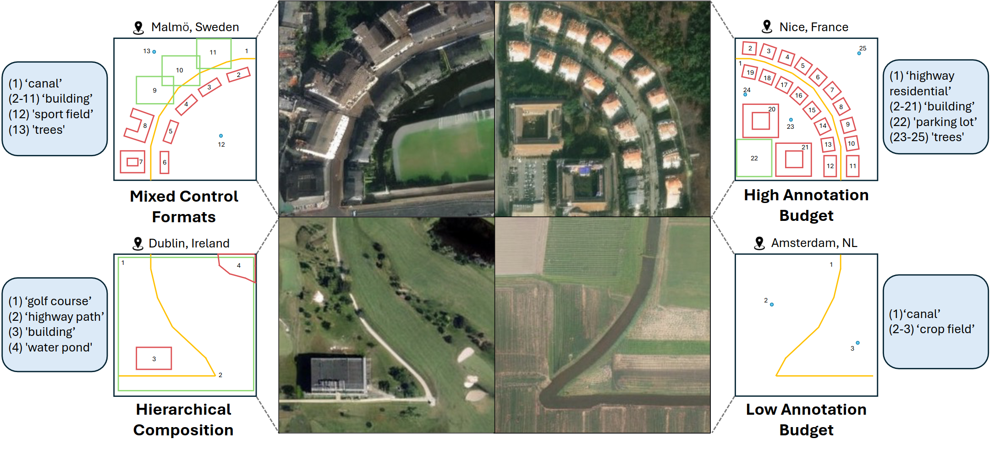
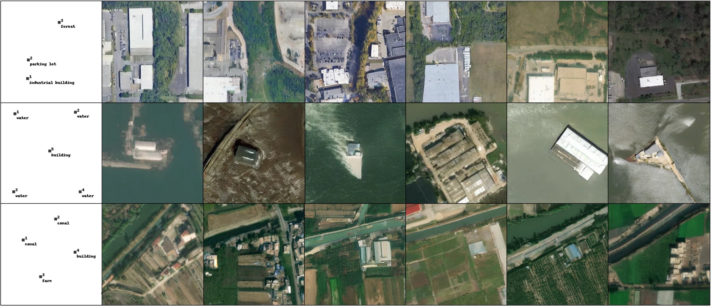

<div align="center">

# TerraDiT (ECCV 2026)

<sub>Official reimplementation of the **TerraDiT-α (alpha)**, **TerraDiT-Σ (Sigma)**, and **TerraDiT-Ω (Omega)** models, unifying two papers:</sub><br/>
<sub>• **TerraDiT: Point-Conditioned Diffusion Transformer for Satellite Image Synthesis** — α + Σ</sub><br/>
<sub>• **TerraDiT-Ω: Unified Spatial Control for Satellite Image Synthesis with Any Geospatial Primitive** — Ω</sub>

</div>

<div align="center">

| Model | Conditioning | Backbone | Paper |
| --- | --- | --- | --- |
| **TerraDiT-α** | text | SiT-XL/2 | TerraDiT |
| **TerraDiT-Σ** | text + geolocation + point prompts | SiT-XL/2 | TerraDiT |
| **TerraDiT-Ω** | text + geolocation + geospatial primitives | SiT-XL/2 · SiT-B/2 | TerraDiT-Ω |

</div>

<br/>

> [!NOTE]
> 🚧 **Code, pretrained weights, and data are coming soon.** 

---

<div align="center">

## TerraDiT-Ω: Unified Spatial Control for Satellite Image Synthesis with Any Geospatial Primitive (ECCV 2026)

<br/>



<br/>

[](#)
[](https://brian-j-wei.github.io/geodit-omega/index.html)

[Brian Wei*](https://brian-j-wei.github.io/),
[Srikumar Sastry*](https://vishu26.github.io/),
[Dan Cher*](https://dcher95.github.io/),
[Eric Xing](https://ericx003.github.io/),
[Nathan Jacobs](https://jacobsn.github.io/)

*Equal Contribution &nbsp;·&nbsp;

</div>

TerraDiT-Ω generalizes point-conditioned control to **any geospatial primitive** — points,
bounding boxes, polylines, and polygons — through **Geometry-Aware Local Attention (GALA)**.
A single model accepts heterogeneous instance geometry plus a global caption and geolocation,
giving precise per-instance spatial control over satellite image synthesis without dense maps.

<br/>

---

<div align="center">

## TerraDiT: Point-Conditioned Diffusion Transformer for Satellite Image Synthesis

<br/>



<br/>

[](#)
[](#)

[Srikumar Sastry*](https://vishu26.github.io/),
[Dan Cher*](https://dcher95.github.io/),
[Brian Wei*](https://brian-j-wei.github.io/),
[Aayush Dhakal](https://sites.wustl.edu/aayush/),
[Subash Khanal](https://subash-khanal.github.io/),
[Dev Gupta](https://splashing23.github.io/),
[Nathan Jacobs](https://jacobsn.github.io/)

*Equal Contribution &nbsp;·&nbsp;

</div>

TerraDiT generates satellite images conditioned on **point queries** — spatial points paired with
textual descriptions — enabling precise, annotation-efficient control without dense maps. An
adaptive local attention mechanism around these point queries (TerraDiT-Σ) yields fine-grained
spatial guidance, while the text-only base (TerraDiT-α) provides the underlying T2I model.

---

## 🚧 Code & Models — Coming Soon

We are preparing the official release. The following will be published here shortly:

- [ ] 🧩 **Code** — training, inference, and test-split generation for α / Σ / Ω (and the Ω base model)
- [ ] 📦 **Pretrained weights** — `alpha_xl`, `sigma_xl`, `omega_xl`, and `omega_base`
- [ ] 🗂️ **Data** — derived conditioning artifacts (imagery referenced from the public Git-10M dataset)
- [ ] 🎨 **Demos** — text, point-prompt, and geospatial-primitive conditioning, with live lat/lon geolocation

## 📚 Citation

If you find our work useful, please consider citing:

```bibtex
@inproceedings{wei2026terraditomega,
  title     = {TerraDiT-{\Omega}: Unified Spatial Control for Satellite Image Synthesis with Any Geospatial Primitive},
  author    = {Wei, Brian and Sastry, Srikumar and Cher, Daniel and Xing, Eric and Jacobs, Nathan},
  booktitle = {European Conference on Computer Vision},
  year      = {2026}
}
```
```bibtex
@article{sastry2026terradit,
  title   = {TerraDiT: Point-Conditioned Diffusion Transformer for Satellite Image Synthesis},
  author  = {Sastry, Srikumar and Cher, Daniel and Wei, Brian and Dhakal, Aayush and Khanal, Subash and Gupta, Dev and Jacobs, Nathan},
  journal = {arXiv:2603.02172},
  year    = {2026}
}
```


## 🙏 Acknowledgements

Built on [SiT](https://github.com/willisma/SiT), [REPA](https://github.com/sihyun-yu/REPA),
[RANGE](https://github.com/mvrl/RANGE), the [SDXL VAE](https://huggingface.co/stabilityai/sdxl-vae),
and LongCLIP. Imagery from [Git-10M](https://huggingface.co/datasets/lcybuaa/Git-10M).

## 🔍 Additional Links

Check out our lab website for other work:
* Multimodal Vision Research Lab (MVRL) — [Link](https://mvrl.cse.wustl.edu/)
* Related works from MVRL — [Link](https://mvrl.cse.wustl.edu/publications/)
